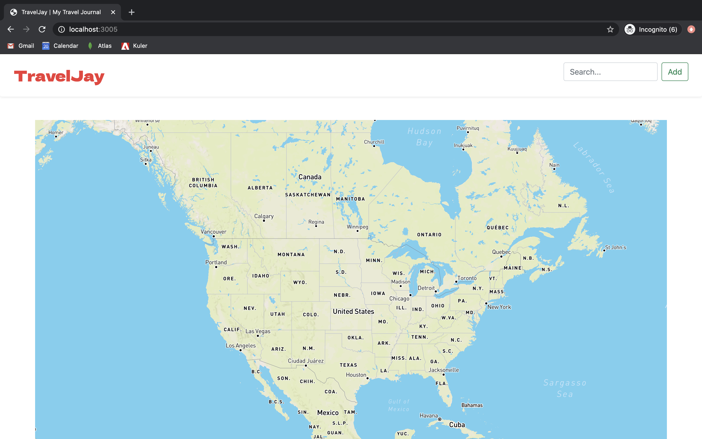
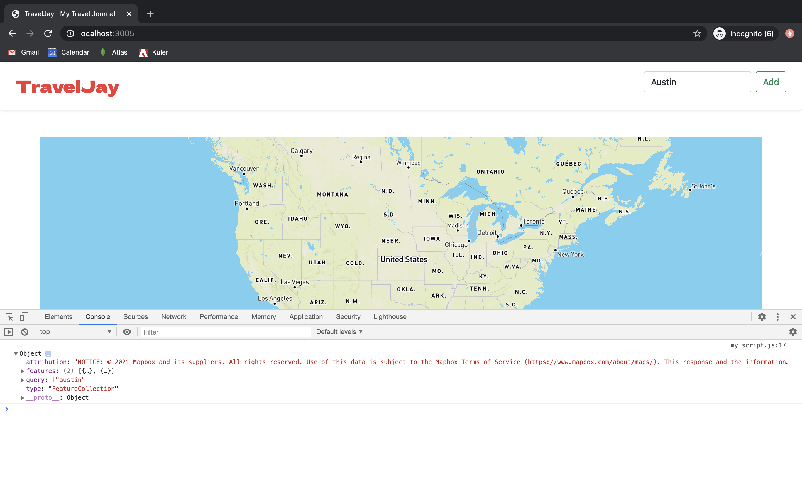
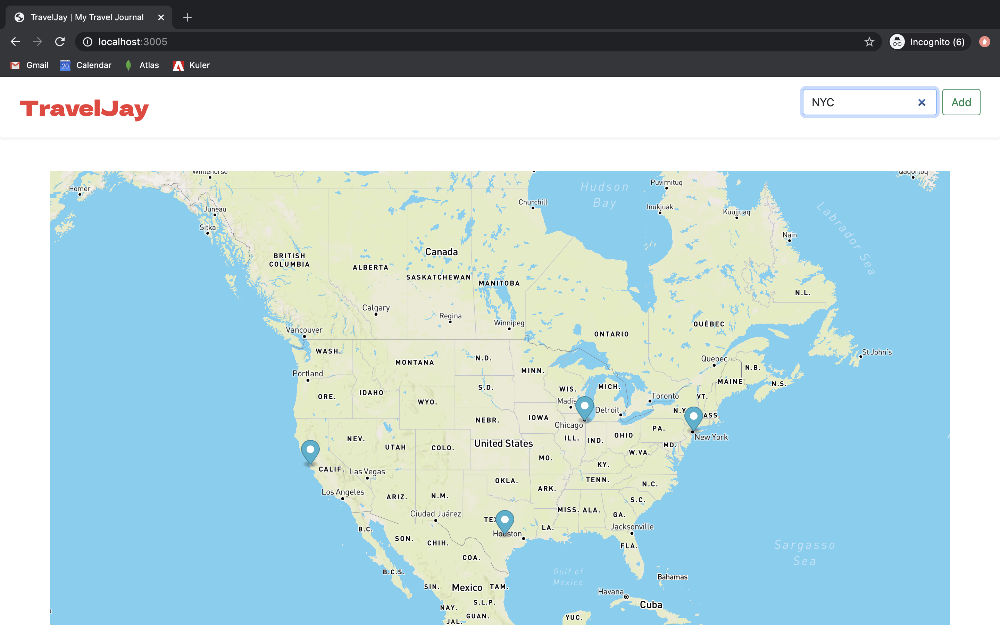

Hi everyone!

Anyone that knows me knows that I really enjoy cartography and that I'm always looking for an excuse to build something cool or fun with maps and mapping technologies. Lately, I've been playing around with the Mapbox API to see what kinds of neat things I could build. Given my love for traveling, I thought I'd demonstrate how to use the Mapbox API to build the first steps of a lightweight travel journal called TravelJay. I hope that this journal comes in handy for those about to hit the road to explore new destinations, or for those who want to keep a journal of where they've traveled to in the past. Here's an overview of what I'll cover:

**End Outcome**: As a user, I can add markers to a map to indicate places I've traveled to or placed I'd like to travel to.

**Technologies we'll use:**

* **HTML** – I'll provide you with some markup to structure the app's front-end.

* **Bootstrap** – Instead of fiddling around with CSS, we'll leverage Bootstrap's out-of-the-box CSS styles to quickly make our web app look presentable.

* **JavaScript** – We'll add JavaScript to handle the user interactions (i.e., clicking on a button) and calls to the Mapbox API that make up the core experience of the travel journal.

* **Mapbox API** – We'll use Mapbox's Maps API, Geocoding REST API, and Marker API to build a map, retrieve location data based on user input, and place a marker on the map, respectively.

* **Git / GitHub** – I'll provide the starting code in a repository in case you'd like to paste in the code snippets along the way.

**Tools we'll use:**

* **A text editor** – I'll be writing my code in my preferred text editor: Sublime Text 3.

* **A terminal** – I'll be using iTerm2 on my Mac.

* **A web browser** with developer tools – I'll be previewing and testing the web app using the developer tools in Google Chrome.

* **Python** – I'm going to use Python to start a local server on my computer that can serve HTTP so that we can preview the app locally.


**Here are the general steps we'll take:**

* Create a Mapbox account
* Generate a Mapbox API access token
* Give the Mapbox API a try
* Clone the repo containing the starting code
* Start a simple, local HTTP server to preview the app
* Add the Mapbox libraries
* Add a map to your app!
* Return location data from Mapbox
* Add markers to your map
* Future functionality for your app

Let's get started!

---

**1. Create a Mapbox account**

To use the Mapbox APIs you'll need an API access token. To obtain a token, you'll first need to create a [Mapbox account](https://account.mapbox.com/auth/signup/).

**2. Generate your Mapbox API access token**

Navigate to the [Access Tokens page](https://account.mapbox.com/access-tokens/) in your account and generate an access token by clicking the **+ Create a token** button. Take note of this token, as you'll use it to build the travel journal app.

**3. Give the Mapbox API a try!**

Mapbox has several, fun APIs you can use. One such API is the [Mapbox Geocoding API](https://docs.mapbox.com/api/search/geocoding/), which can convert a text location into geographic coordinates ("forward geocoding"), or convert geographic coordinates into a text location ("reverse geocoding"). In a later step, we'll use this API in our app to perform forward geocoding, but for now, you can give it a quick try directly from the command line to get a feel for how it works. 

1. Open your terminal.

2. Copy and paste the following command into your terminal (we'll cover the exact details of this command in a later step). Replace `YOUR_ACCESS_TOKEN` with the access token you generated in [your Mapbox account](https://account.mapbox.com/access-tokens/). Alternatively, you can [copy this command from the corresponding documentation](https://docs.mapbox.com/api/search/geocoding/#example-request-forward-geocoding). If you're logged in to your Mapbox account `YOUR_ACCESS_TOKEN` will automatically be populated for you throughout the Mapbox documentation. 

```bash
curl "https://api.mapbox.com/geocoding/v5/mapbox.places/Washington.json?limit=2&access_token=YOUR_ACCESS_TOKEN"
```

3. Run the command. If successful, you should receive a response from the API like the one below, which contains geographic details about Washington, D.C. in the United States. In a later step, we'll programmatically navigate this response in our app to build our travel journal.

```
{"type":"FeatureCollection","query":["washington"],"features":[{"id":"region.9713796497246050","type":"Feature","place_type":["region"],"relevance":1,"properties":{"wikidata":"Q1223","short_code":"US-WA"},"text":"Washington","place_name":"Washington, United States","bbox":[-124.862197896945,45.5435400017256,-116.916070668425,49.0121490866648],"center":[-120.094292506456,48.0250054263],"geometry":{"type":"Point","coordinates":[-120.094292506456,48.0250054263]},"context":[{"id":"country.19678805456372290","wikidata":"Q30","short_code":"us","text":"United States"}]},{"id":"place.12583600763246050","type":"Feature","place_type":["place"],"relevance":1,"properties":{"wikidata":"Q61"},"text":"Washington","place_name":"Washington, District of Columbia, United States","bbox":[-77.1197609976268,38.7916430026287,-76.9093910049567,38.9958469974476],"center":[-77.0366,38.895],"geometry":{"type":"Point","coordinates":[-77.0366,38.895]},"context":[{"id":"region.14064402149979320","wikidata":"Q3551781","short_code":"US-DC","text":"District of Columbia"},{"id":"country.19678805456372290","wikidata":"Q30","short_code":"us","text":"United States"}]}],"attribution":"NOTICE: © 2021 Mapbox and its suppliers. All rights reserved. Use of this data is subject to the Mapbox Terms of Service (https://www.mapbox.com/about/maps/). This response and the information it contains may not be retained. POI(s) provided by Foursquare."}%
```

**4. Clone the repo containing the starting code**

I've provided the starting code for the app so that we can focus on the Mapbox APIs and not worry too much about HTML structure and CSS styling. To obtain the code, you'll need to clone the **traveljay** repository I created on GitHub.

Open your terminal and run the following command:

```bash
git clone https://github.com/ghdz89/traveljay.git
```

The sample app is made up of only 2 files! You should see **index.html** and **my_script.js** in the **traveljay** folder. I'll refer to these two files moving forward.

**5. Start an HTTP server to preview your app**

To preview your app locally, you can use Python to start a local server that can serve HTTP. In the **traveljay** folder, run the following command:

(Python 2.x)
```py
python -m SimpleHTTPServer 3000
```

(Python 3.x)
```py
python3 -m http.server 3000
```

In your browser, navigate to localhost:3000 (or whatever post you specified). You should be able to preview the starting code.


**6. Add the Mapbox libraries**

We're going to use Mapbox GL JS to build the app's map. Mapbox GL JS is a JavaScript library that can be used to render maps and other map attributes. To learn more about the library's API, visit the [Mapbox GL JS API Reference documentation](https://docs.mapbox.com/mapbox-gl-js/api/).

We'll add this library using the Mapbox CDN. Open **index.html** and add the following lines of code on line 4 (right after the closing `</title>` tag).

```html
<script src='https://api.mapbox.com/mapbox-gl-js/v2.2.0/mapbox-gl.js'></script>
<link href='https://api.mapbox.com/mapbox-gl-js/v2.2.0/mapbox-gl.css' rel='stylesheet' />
```

**7. Add a map to your app!**

Now we're ready to start building with Mapbox. 

Open **my_script.js** and add the following lines of code at the top. Replace `YOUR_ACCESS_TOKEN` with your Mapbox API access token.

```javascript
mapboxgl.accessToken = 'YOUR_ACCESS_TOKEN';
myToken = mapboxgl.accessToken; // just to make this a bit more concise to type later on
```
---

**IMPORTANT:** We've just added your API access token directly to the **my_script.js file**. To prevent malicious abuse of your token by bad actors, it's typically considered best practice to [store secrets (like access tokens) in **.env** files](https://www.google.com/search?q=storing+secrets+in+environment+variables+javascript) and programmatically refer to those secrets from files that require those secrets. Since we're building a small, local app we won't be doing this. Take care to avoid public exposure of your Mapbox access token (i.e., pushing to GitHub, etc.).

---

Next, create the map by adding the following:

```javascript
var map = new mapboxgl.Map({
  container: 'map', // container ID
  style: 'mapbox://styles/mapbox/streets-v11', // map style
  center: [-98.35, 39.50], // starting position [lng, lat]
  zoom: 3 // starting zoom level
});
```

We use `mapboxgl.Map()` to create a new map instance and then pass in an object with the following options:

* `container: 'map'` is a reference to the HTML element that will contain and display the map. If you open **index.html**, you'll notice there's already a `<div>` with an id of `"map"` present. This `<div>` will contain your map.

* The value of `style` refers to the map style. I enjoy the default style, but you can [use other map styles](https://docs.mapbox.com/api/maps/styles/#mapbox-styles) if you'd like.

* The value of `center` is an array of geographical coordinates used to center the map in our app when it first loads. I chose –98.35 (longitude) and –39.50 (latitude), which represent [the center of the contiguous United States](https://en.wikipedia.org/wiki/Geographic_center_of_the_United_States#Contiguous_United_States), but you can pick your own center point.

* The value of `zoom` represents the starting [zoom level of the map](https://docs.mapbox.com/help/glossary/zoom-level/). Increasing this value "zooms in" on the map while decreasing it "zooms out".

At this point, you should be able to preview your map on your app. Navigate to localhost:3000 (or whatever port you specified earlier) and check it out!



**8. Return location data from the Mapbox Geocoding API**

You probably noticed that the starting code in **index.html** included a form for input along with a button. Currently, when you use these elements, they do nothing, but we're going to change that!

First, add a 'click' event listener to the "Add" button by adding the following code to **my_script.js**.

```javascript
const btn = document.getElementById('add-marker').addEventListener('click', addMarker, false);
```

This line of code runs the `addMarker()` function when the "Add" button is clicked. For this to function properly, we'll need to actually create the `addMarker()` function. *Above this line of code*, add the following:

```javascript
function addMarker(event) {
  let location = document.getElementById('mb-gc').value;
  fetch('https://api.mapbox.com/geocoding/v5/mapbox.places/' + location + '.json?limit=2&access_token=' + myToken)
  .then(response => response.json())
  .then(data => {
    console.log(data);
   });
   event.preventDefault();
}
```

A few important things are happening here:

1. We capture the user's input and store it in the `location` variable.

2. We concatenate the location with [Mapbox's forward geocoding API endpoint](https://docs.mapbox.com/api/search/geocoding/#forward-geocoding), along with a few options.

```
/geocoding/v5/{endpoint}/{search_text}.json?limit=2&access_token=myToken
```

`{endpoint}` is set to `mapbox.places` ([more details here](https://docs.mapbox.com/api/search/geocoding/#endpoints)), `{search_text}` is replaced by the contents of the `location` variable, `limit=2` limits the results returned from the endpoint to 2, and `access_token` is set to your `myToken`, which is required to make a successful call to the endpoint. When the call is made, the resource requested will have the following structure (as an example):

```
'https://api.mapbox.com/geocoding/v5/mapbox.places/Miami.json?limit=2&access_token=myToken'
```

3. We use `fetch()` to make a `GET` request to the endpoint outlined above.

4. [Fetch returns a Promise](https://developer.mozilla.org/en-US/docs/Web/API/Fetch_API/Using_Fetch), which first returns an HTTP response. We call `.json()` on the HTTP response to extract the JSON content from the response. Finally, we log that data to the console as a [sanity check](https://en.wikipedia.org/wiki/Sanity_check) to make sure our request was successful.

5. `event.preventDefault()` just makes sure your page doesn't reload when you click the **Add** button (which would result in your marker not being added to the map).

This code won't place a marker on your app – yet! But you should be able to use the form input and view the results in your browser's console. Navigate over to localhost:3000 and try it out!



**9. Add markers to your map based on user input**

Now that we're able to successfully return location data, let's use it to add markers to the map. In **my_script.js**, add the following code after ``console.log(data);``:

```javascript
var marker = new mapboxgl.Marker()
  .setLngLat([data.features[0].center[0], data.features[0].center[1]])
  .addTo(map);
```

Your code should now look like this:

```javascript
function addMarker(event) {
  let location = document.getElementById('mb-gc').value;
  fetch('https://api.mapbox.com/geocoding/v5/mapbox.places/' + location + '.json?limit=2&access_token=' + myToken)
  .then(response => response.json())
  .then(data => {
    console.log(data);
    var marker = new mapboxgl.Marker()
      .setLngLat([data.features[0].center[0], data.features[0].center[1]])
      .addTo(map);
    });
   event.preventDefault();
}
```

Let's walk through what this code does:

1. A new `marker` is created using `mapboxgl.Marker()`.

2. We then set the position of the marker (i.e., longitude and latitude) using the location data returned in the response. If you take a look at the response using your browser's console, you'll notice that the response returns a `features` array with two nested arrays. We access the first element (i.e., the first array) with `data.features[0]` and then we access another nested array called `center` containing the longitude and latitude coordinates, like so: `data.features[0].center[0]`(longitude), and `data.features[0].center[1]`(latitude).

3. We finally add the marker to the map using `.addTo(map)`.

Try it out at localhost:3000 – you should now be able to add markers to the map!



If you'd like to prevent endpoint calls with empty queries (i.e., no user input), you can nest your current code in the following if/else statement. I found this to be a quick and easy way of limiting invalid calls to the API endpoint, which is especially useful in other situations where there are limits on the number of requests that can be made to an endpoint.

```javascript
function addMarker(event) {
  let submission = document.getElementById('mb-gc').value;
  if (submission!="") {
    fetch('https://api.mapbox.com/geocoding/v5/mapbox.places/' + location + '.json?limit=2&access_token=' + myToken)
    .then(response => response.json())
    .then(data => {
      console.log(data);
      var marker = new mapboxgl.Marker()
        .setLngLat([data.features[0].center[0], data.features[0].center[1]])
        .addTo(map);
    });
  } else {
    event.preventDefault();
  }  
}
```

**10. Future functionality to explore**

That's it! You've built out the initial functionality of TravelJay with just a few lines of code in two files. Now that you've gotten a taste of what's possible with the Mapbox API, here's a couple of ideas for future functionality that you may want to consider adding:

* It would be nice to be able to attach memories to the markers you place in your journal. Can you figure out how to attach text (or photos, or any other media) to a marker after clicking on it? You may need to build out additional input components within TravelJay. For the Marker functionality, I recommend [Mapbox's Markers and Controls API Reference documentation](https://docs.mapbox.com/mapbox-gl-js/api/markers/).

* Pressing "return" or "Enter" on your keyboard after typing a location into the input form simply reloads the page, which can be frustrating. Following a similar pattern to the one I outlined for the **Add** button, try to add functionality that will make a call to the Geocoding API after pressing "return" or "Enter" on your keyboard.

Last, but not least, here's TravelJay as we built it out in this blog post (in case you'd like to fiddle with it): [TravelJay](http://www.ghv.io/traveljay/). 

I'm always open to hearing and learning more about mapping technologies! Feel free to comment on this post or reach out to me with any suggestions you may have. Happy hacking!
